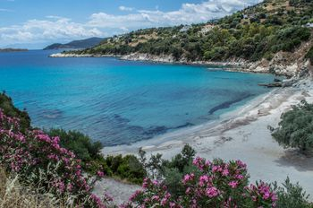
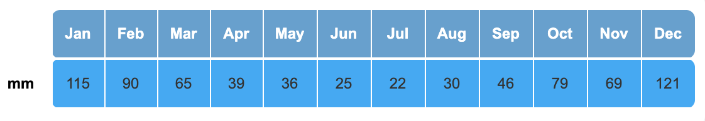
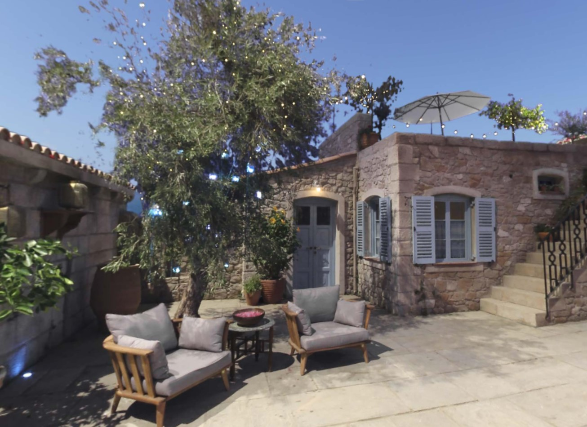
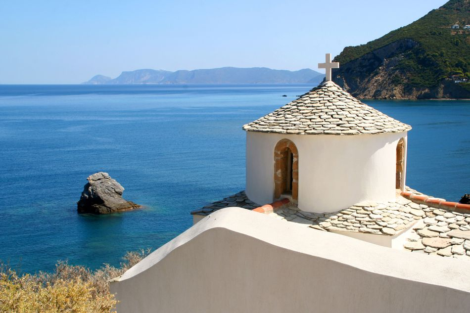
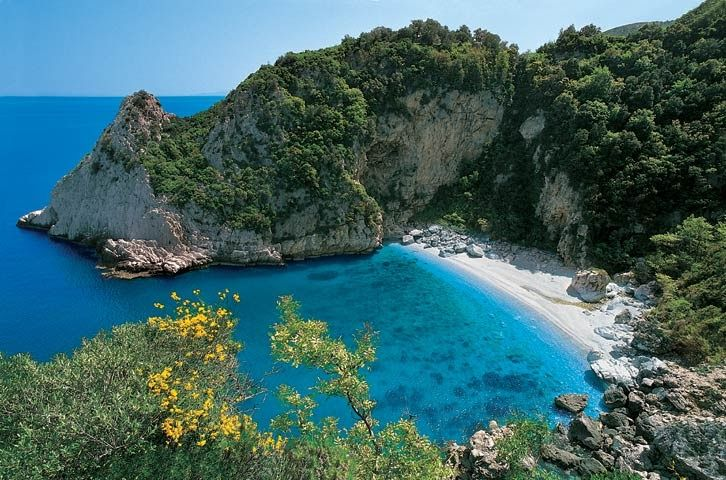
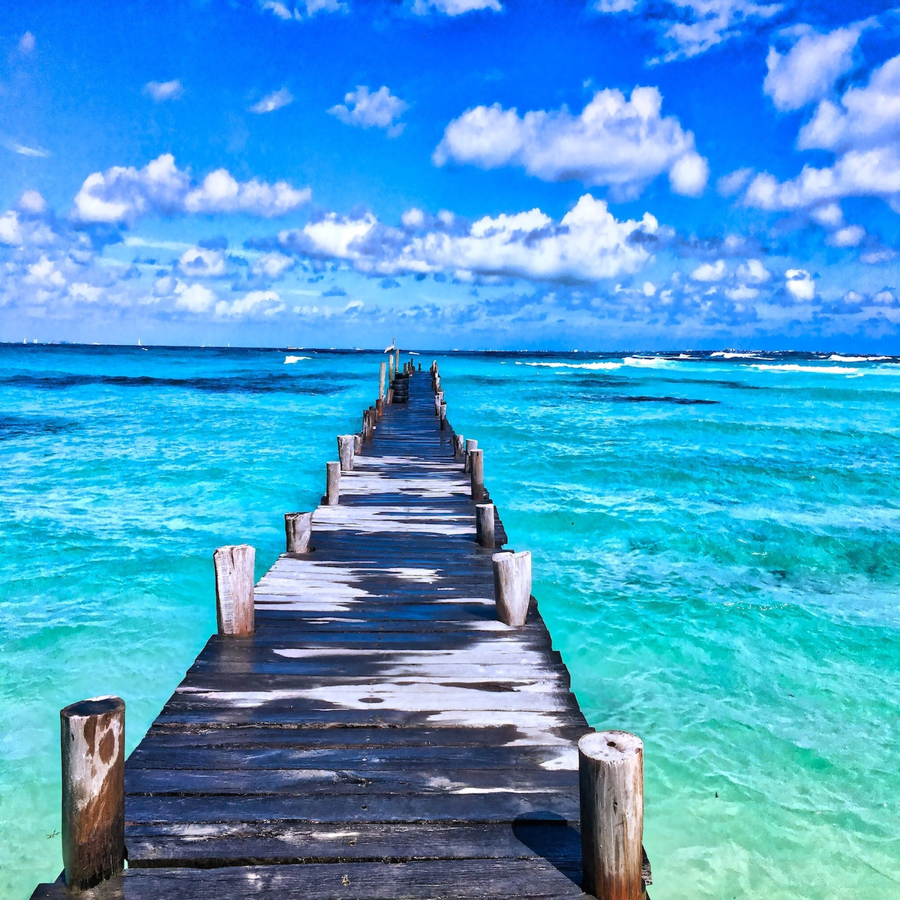
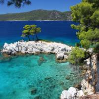
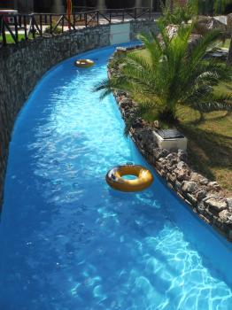

# Aphrodite's Island

---
# Kalokairi

---
## About Kalokairi:
- As the site of Aphrodite's fountain, it is the ultimate romantic destination.
- So many wonderful attractions
- Need help? Well there's no shortage of English speakers (not just the staff the villagers too)
- Beautiful nights: cool, starry and cloudless

---
## Are attractions your thing?
We provide electronic tour guides at the start of your stay, free of charge!

This device comes with earphones, but you can exchange them for headphones if preffered. Broken or damaged earphones will be replaced at front desk.

This device reads out information about the chosen attraction. If you don't feel like listening to long, boring descriptions, well don't worry. This device gives short detailed explanations to keep you interested but informed.

### How to use:
- Look at the map displayed at the bottom of the device, and locate the attraction you would like to visit.
- Type in the number of the attraction and press enter. Mistype? Just press the reset button to retype your number.

If you damage this device you will have to pay £50 (€56) for repairs.

---
## What Is There To Do?
There are so many fun activities to do during your stay at Kalokari. Here's a few:

- Dolphin and Whale watching
- Scuba and Snorkeling
- Stand-up Paddleboarding
- Kayaking and Conoeing
- Hire equimpent and/or boats
- Bike and Boat Tours
- And multiple there's beaches

---
## Storm Season
Prices will vary depending on the time of year, as storms will occur.
- GREEN- No chance of storms (May, June, July, August)
- ORANGE- Possible chance of storms (March, April, September, October)
- RED- Hight chance of storms (January, February, November, December)

During the GREEN section the price will range from £800 and over.

During the ORANGE section the price will range from  £750 and over.

During the RED section the price will range from £650 and over.

If you do choose to come to Kalokairi during storm season the only way to be safe from the storm, is to be inside. As this is the case we have direct paths from the attrations to the accomadations,for a safer, quicker journey inside.

---
## It's Famous!
Kalokairi is the iconic island in the movies in Mamma Mia! and Mamma Mia! Here We Go Again.

[Mamma Mia](https://www.youtube.com/watch?v=lkN-A00WLYE)

[Mamma Mia: Here We Go Again Trailer](https://www.youtube.com/watch?v=XcSMdhfKga4)

---
## Reviews

"It's so amazing, I'll definitely be coming back."

"There is so much to do! Everyday is a new adventure, my family and I loved it."

---
## Picture Gallery

